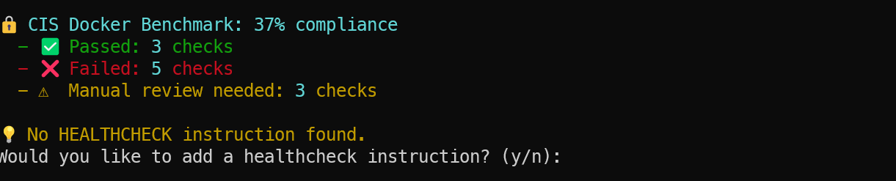

# Dockerfile Optimizer & Security Scanner


## Overview
This project provides a Python-based tool for analyzing, optimizing, and securing Dockerfiles. It leverages AI (Google Gemini) and static analysis to identify security issues, performance bottlenecks, and best practice violations, offering optimized Dockerfile configurations for both development and production environments alongside comprehensive security assessments.

## Features

### Core Optimization Features
- **Dockerfile Validation**: Detects critical security issues and anti-patterns.
- **Image Size & Build Time Estimation**: Estimates original and optimized image sizes and build times with detailed analysis.
- **Environment Analysis**: Compares development and production environment configurations.
- **AI-Powered Optimization**: Uses Google Gemini AI to generate optimized Dockerfiles with multi-stage builds and environment-specific configurations.
- **Automatic .dockerignore Generation**: Optionally creates a .dockerignore file to optimize build context.
- **Rich Console Output**: Displays metrics, security checks, and environment analysis in formatted tables using the rich library.

### Security Assessment Features 🔒
- **CIS Docker Benchmark Assessment**: Evaluates Dockerfile against CIS Docker Benchmark standards with severity ratings.
- **Container Escape Analysis**: Detects potential container escape risks and vulnerabilities.
- **Security Report Generation**: Creates comprehensive Markdown security reports with actionable remediation steps.
- **Security Score**: Provides an overall security score with visual indicators to track improvement.
- **Hardcoded Secret Detection**: Identifies potential hardcoded secrets in Dockerfiles.
- **Healthcheck Integration**: Automatically adds appropriate HEALTHCHECK instructions based on application type.
- **Vulnerability Scanning Comments**: Adds vulnerability scanning comments to Dockerfiles.

### CI/CD & Best Practices Integration
- **CI/CD Pipeline Examples**: Provides ready-to-use GitHub Actions, GitLab CI, and CircleCI configurations for Docker security scanning.
- **SBOM Integration Guidance**: Recommendations for generating and utilizing Software Bill of Materials (SBOM).
- **Image Signing Guidance**: Instructions for implementing container image signing with Cosign or Docker Content Trust.
- **Implementation Timeline**: Prioritized security improvement recommendations based on severity levels.
- **Documentation Links**: Curated links to security documentation, tools, and resources.

## 📊 Reports & Analysis

### 🔹 AI Optimization Analysis
A high-level analysis from Gemini AI outlining key improvements and detected issues:


### 🔹 Detailed Security & Optimization Report
Console-based report from the `rich` output (scrollable in terminal):


### 🔹 Security Assessment Report
Comprehensive security assessment with severity indicators, remediation examples, and implementation timeline.
[](./dockerfile_security_report.md)
> **View the [complete security assessment report](./dockerfile_security_report.md) for detailed remediation steps and implementation timelines.**

Key features of the security report:
- Security score with severity-based evaluation
- CIS Docker Benchmark compliance assessment 
- Actionable remediation examples with copy-paste Dockerfile snippets
- Prioritized implementation timeline based on severity
- Ready-to-use CI/CD integration examples

### 🔹 CIS Docker Benchmark Compliance
Evaluation against CIS Docker Benchmark with severity-rated findings:


### 🧾 Before vs After: Dockerfile Optimization

| Version          | Preview                                                               |
| ---------------- | --------------------------------------------------------------------- |
| 🔸 Unoptimized    | [View Dockerfile.unoptimized.backup](./Dockerfile.unoptimized.backup) |
| 🔹 Optimized (AI) | [View Dockerfile.optimized](./Dockerfile.optimized)                   |

💡 These Dockerfiles are available in the root directory for reference and comparison.

## Prerequisites

- **Python**: Version 3.9 or higher
- **Docker**: Installed and running for validation and scanning
- **API Keys**: At least one of the following API keys configured in a .env file:
  - GEMINI_API_KEY (Google Gemini, recommended)
  - OPENAI_API_KEY
  - CLAUDE_API_KEY
  - PERPLEXITY_API_KEY

- **Dependencies**: Install required Python packages (see Setup).

## Setup

1. **Clone the Repository** (or navigate to your project directory):
   ```
   https://github.com/Akhilesh-Varute/dockerfile-optimizer.git
   cd dockerfile-optimizer
   ```

2. **Create a Virtual Environment**:
   ```
   python -m venv venv
   .\venv\Scripts\activate  # On Windows
   ```

3. **Install Dependencies**:
   ```
   pip install -r requirements.txt
   ```

   Example requirements.txt:
   ```
   python-dotenv
   google-generativeai
   rich
   ```

4. **Configure Environment Variables**:Create a .env file in the project root (V:\docker_optimizer\dockerfile-optimizer) with your API key(s):
   ```
   GEMINI_API_KEY=your-gemini-api-key
   # Optionally add other API keys
   # OPENAI_API_KEY=your-openai-api-key
   # CLAUDE_API_KEY=your-claude-api-key
   # PERPLEXITY_API_KEY=your-perplexity-api-key
   ```

   Obtain a Gemini API key from Google Cloud Console.

## Usage
Run the optimization tool by providing the path to your Dockerfile:
```
python docker_optimizer.py
```

You'll be prompted to:

1. Enter the path to your Dockerfile (e.g., V:\docker_optimizer\dockerfile-optimizer\Dockerfile).
2. Confirm the creation of a .dockerignore file (if not present).
3. Choose to add HEALTHCHECK instruction if missing.
4. Generate an enhanced security report with remediation examples and CI/CD integration.
5. Apply the optimized Dockerfile (creates a backup of the original).
6. Add vulnerability scanning comments to your Dockerfile.

## Example Output
The tool generates:

- **Validation Results**: Highlights critical issues (e.g., running as root, insecure installations).
- **CIS Docker Benchmark Assessment**: Shows compliance with industry standard security guidelines.
- **Security Score**: Visual indicator of overall Dockerfile security.
- **Metrics Table**: Compares original vs. optimized image size and build time.
- **Security Checklist**: Shows pass/fail status for key security practices.
- **AI Analysis**: Detailed report from Gemini AI, including security issues, performance optimizations, and an optimized Dockerfile.
- **Security Report**: A comprehensive Markdown report with actionable remediations, implementation timeline, and CI/CD integration examples.
- **Optimized Dockerfile**: A multi-stage, environment-aware Dockerfile tailored for your application (Node.js, Python, or generic).

## Security Report Features

The generated security report includes:

### Security Assessment
- **Security Score**: Overall percentage score with color indicator (🟢 Good, 🟡 Medium, 🔴 Poor).
- **Container Escape Risks**: Analysis of potential container breakout vulnerabilities.
- **CIS Docker Benchmark**: Assessment against industry-standard security guidelines.
- **Severity Indicators**: Security issues marked by severity (CRITICAL, HIGH, MEDIUM, LOW).

### Actionable Remediation
- **Remediation Examples**: Ready-to-use Dockerfile code snippets to fix security issues.
- **Implementation Timeline**: Prioritized fixes based on severity (Immediate, Short-term, Mid-term, Long-term).
- **Best Practices**: Comprehensive container security best practices by category.

### DevOps Integration
- **CI/CD Pipeline Examples**: Ready-to-use configurations for:
  - GitHub Actions
  - GitLab CI
  - CircleCI
- **SBOM Integration**: Guidance for Software Bill of Materials generation.
- **Image Signing**: Instructions for implementing container signing.

### Documentation
- **Official Resources**: Links to Docker security documentation.
- **Security Tools**: Links to recommended container security tools.
- **Distroless Alternatives**: Information on minimal, secure base images.

## Project Structure
```
dockerfile-optimizer\
├── docker_optimizer.py    # Main script
├── requirements.txt       # Python dependencies
├── .env                   # Environment variables (not committed)
├── dockerfile_security_report.md # Generated security report
```

## Supported Application Types
The tool automatically detects and optimizes for:

- **Node.js Applications**: Handles npm/yarn, package.json, and production builds.
- **Python Applications**: Supports pip, requirements.txt, and slim Python images.
- **Generic Applications**: Provides a flexible template for other base images.

## Security Standards Enforced

### CIS Docker Benchmark
- User configuration (non-root)
- Trusted base images
- Minimal package installation
- Version-specific tags (no latest)
- Content trust verification
- Healthcheck configuration
- Proper update instructions
- Setuid/setgid permissions
- COPY vs ADD usage
- Secret management
- Package verification

### Container Security Best Practices
- Runtime security controls
- Image hardening techniques
- Supply chain security measures
- Configuration security patterns
- Operational security monitoring
- Resource limitation recommendations

## Limitations

- Currently supports Google Gemini AI; other providers (OpenAI, Claude, Perplexity) are not yet implemented.
- Image size and build time estimations are approximate and depend on the Dockerfile's complexity.
- Requires manual review of the optimized Dockerfile for application-specific requirements.
- Security assessments focus on static analysis and may not detect runtime vulnerabilities.

## Contributing
Contributions are welcome! Please:

1. Fork the repository.
2. Create a feature branch (git checkout -b feature/your-feature).
3. Commit changes (git commit -m 'Add your feature').
4. Push to the branch (git push origin feature/your-feature).
5. Open a pull request.

## License
This project is licensed under the MIT License:
<details>
<summary>📄 MIT License</summary>

Copyright (c) 2025 Akhilesh Varute

Permission is hereby granted, free of charge, to any person obtaining a copy
of this software and associated documentation files (the "Software"), to deal
in the Software without restriction, including without limitation the rights
to use, copy, modify, merge, publish, distribute, sublicense, and/or sell
copies of the Software, and to permit persons to whom the Software is
furnished to do so, subject to the following conditions:

The above copyright notice and this permission notice shall be included in all
copies or substantial portions of the Software.

THE SOFTWARE IS PROVIDED "AS IS", WITHOUT WARRANTY OF ANY KIND, EXPRESS OR
IMPLIED, INCLUDING BUT NOT LIMITED TO THE WARRANTIES OF MERCHANTABILITY,
FITNESS FOR A PARTICULAR PURPOSE AND NONINFRINGEMENT. IN NO EVENT SHALL THE
AUTHORS OR COPYRIGHT HOLDERS BE LIABLE FOR ANY CLAIM, DAMAGES OR OTHER
LIABILITY, WHETHER IN AN ACTION OF CONTRACT, TORT OR OTHERWISE, ARISING FROM,
OUT OF OR IN CONNECTION WITH THE SOFTWARE OR THE USE OR OTHER DEALINGS IN THE
SOFTWARE.

</details>

## Contact
For issues or questions, contact the maintainer or create an issue.

Generated on May 19, 2025