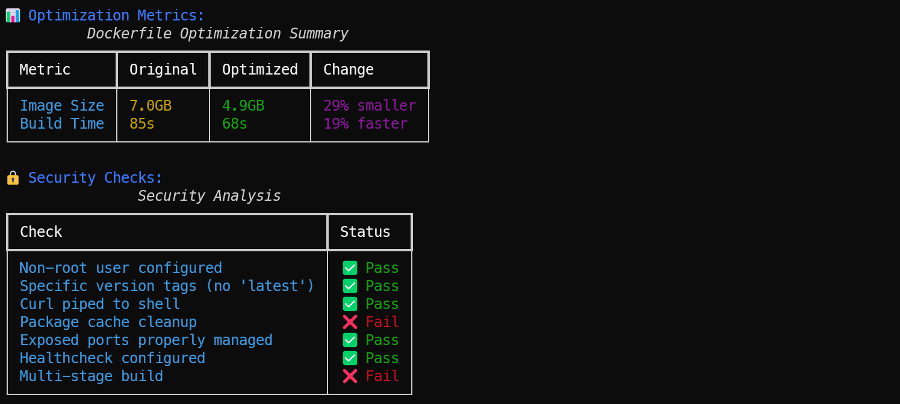
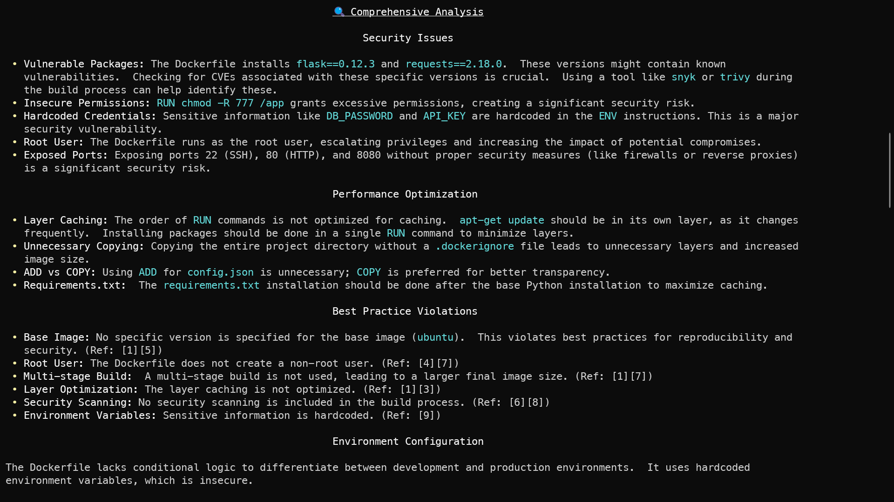

# Optimize Dockerfile with AI


## Overview
This project provides a Python-based tool for analyzing and optimizing Dockerfiles. It leverages AI (Google Gemini) and static analysis to identify security issues, performance bottlenecks, and best practice violations, offering optimized Dockerfile configurations for both development and production environments.

## Features

- **Dockerfile Validation**: Detects critical security issues and anti-patterns.
- **Image Size & Build Time Estimation**: Estimates original and optimized image sizes and build times with detailed analysis.
- **Security Checklist**: Generates a comprehensive security checklist based on Dockerfile content.
- **Environment Analysis**: Compares development and production environment configurations.
- **AI-Powered Optimization**: Uses Google Gemini AI to generate optimized Dockerfiles with multi-stage builds and environment-specific configurations.
- **Automatic .dockerignore Generation**: Optionally creates a .dockerignore file to optimize build context.
- **Rich Console Output**: Displays metrics, security checks, and environment analysis in formatted tables using the rich library.

## 📊 AI Analysis Reports

### 🔹 AI Findings Summary
A high-level analysis from Gemini AI outlining key improvements and detected issues:



### 🔹 Detailed Security & Optimization Report
Console-based report from the `rich` output (scrollable in terminal):




### 🧾 Before vs After: Dockerfile Optimization

| Version          | Preview                                                               |
| ---------------- | --------------------------------------------------------------------- |
| 🔸 Unoptimized    | [View Dockerfile.unoptimized.backup](./Dockerfile.unoptimized.backup) |
| 🔹 Optimized (AI) | [View Dockerfile.optimized](./Dockerfile.optimized)                   |

💡 These Dockerfiles are available in the root directory for reference and comparison.

## Prerequisites

- **Python**: Version 3.9 or higher
- **Docker**: Installed and running for validation and scanning
- **API Keys**: At least one of the following API keys configured in a .env file:
  - GEMINI_API_KEY (Google Gemini, recommended)
  - OPENAI_API_KEY
  - CLAUDE_API_KEY
  - PERPLEXITY_API_KEY

- **Dependencies**: Install required Python packages (see Setup).

## Setup

1. **Clone the Repository** (or navigate to your project directory):
   ```
   https://github.com/Akhilesh-Varute/dockerfile-optimizer.git
   cd dockerfile-optimizer
   ```

2. **Create a Virtual Environment**:
   ```
   python -m venv venv
   .\venv\Scripts\activate  # On Windows
   ```

3. **Install Dependencies**:
   ```
   pip install -r requirements.txt
   ```

   Example requirements.txt:
   ```
   python-dotenv
   google-generativeai
   rich
   ```

4. **Configure Environment Variables**:Create a .env file in the project root (V:\docker_optimizer\dockerfile-optimizer) with your API key(s):
   ```
   GEMINI_API_KEY=your-gemini-api-key
   # Optionally add other API keys
   # OPENAI_API_KEY=your-openai-api-key
   # CLAUDE_API_KEY=your-claude-api-key
   # PERPLEXITY_API_KEY=your-perplexity-api-key
   ```

   Obtain a Gemini API key from Google Cloud Console.

## Usage
Run the optimization tool by providing the path to your Dockerfile:
```
python docker_optimizer.py
```

You'll be prompted to:

1. Enter the path to your Dockerfile (e.g., V:\docker_optimizer\dockerfile-optimizer\Dockerfile).
2. Confirm the creation of a .dockerignore file (if not present).
3. Apply the optimized Dockerfile (creates a backup of the original).

## Example Output
The tool generates:

- **Validation Results**: Highlights critical issues (e.g., running as root, insecure installations).
- **Metrics Table**: Compares original vs. optimized image size and build time.
- **Security Checklist**: Shows pass/fail status for key security practices.
- **AI Analysis**: Detailed report from Gemini AI, including security issues, performance optimizations, and an optimized Dockerfile.
- **Optimized Dockerfile**: A multi-stage, environment-aware Dockerfile tailored for your application (Node.js, Python, or generic).

## Project Structure
```
dockerfile-optimizer\
├── docker_optimizer.py    # Main script
├── requirements.txt       # Python dependencies
├── .env                   # Environment variables (not committed)
```

## Supported Application Types
The tool automatically detects and optimizes for:

- **Node.js Applications**: Handles npm/yarn, package.json, and production builds.
- **Python Applications**: Supports pip, requirements.txt, and slim Python images.
- **Generic Applications**: Provides a flexible template for other base images.

## Best Practices Enforced

- Multi-stage builds for smaller images
- Non-root user configuration
- Specific base image versions (no latest)
- Optimized layer caching
- Security scanning recommendations
- Environment-specific configurations (development vs. production)
- Healthchecks and proper port management
- Package cache cleanup

## Limitations

- Currently supports Google Gemini AI; other providers (OpenAI, Claude, Perplexity) are not yet implemented.
- Image size and build time estimations are approximate and depend on the Dockerfile's complexity.
- Requires manual review of the optimized Dockerfile for application-specific requirements.

## Contributing
Contributions are welcome! Please:

1. Fork the repository.
2. Create a feature branch (git checkout -b feature/your-feature).
3. Commit changes (git commit -m 'Add your feature').
4. Push to the branch (git push origin feature/your-feature).
5. Open a pull request.

## License
This project is licensed under the MIT License:
<details>
<summary>📄 MIT License</summary>


Copyright (c) 2025 Akhilesh Varute

Permission is hereby granted, free of charge, to any person obtaining a copy
of this software and associated documentation files (the "Software"), to deal
in the Software without restriction, including without limitation the rights
to use, copy, modify, merge, publish, distribute, sublicense, and/or sell
copies of the Software, and to permit persons to whom the Software is
furnished to do so, subject to the following conditions:

The above copyright notice and this permission notice shall be included in all
copies or substantial portions of the Software.

THE SOFTWARE IS PROVIDED "AS IS", WITHOUT WARRANTY OF ANY KIND, EXPRESS OR
IMPLIED, INCLUDING BUT NOT LIMITED TO THE WARRANTIES OF MERCHANTABILITY,
FITNESS FOR A PARTICULAR PURPOSE AND NONINFRINGEMENT. IN NO EVENT SHALL THE
AUTHORS OR COPYRIGHT HOLDERS BE LIABLE FOR ANY CLAIM, DAMAGES OR OTHER
LIABILITY, WHETHER IN AN ACTION OF CONTRACT, TORT OR OTHERWISE, ARISING FROM,
OUT OF OR IN CONNECTION WITH THE SOFTWARE OR THE USE OR OTHER DEALINGS IN THE
SOFTWARE.

</details>

## Contact
For issues or questions, contact the maintainer or create an issue.

Generated on May 18, 2025
